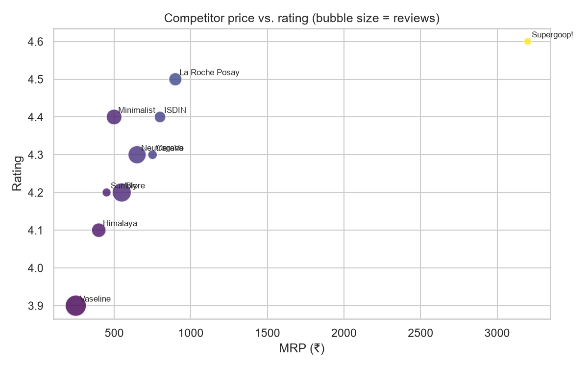
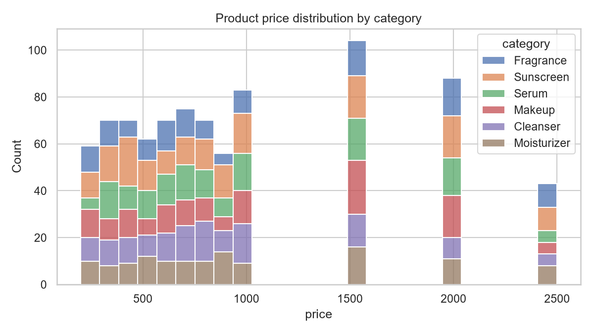
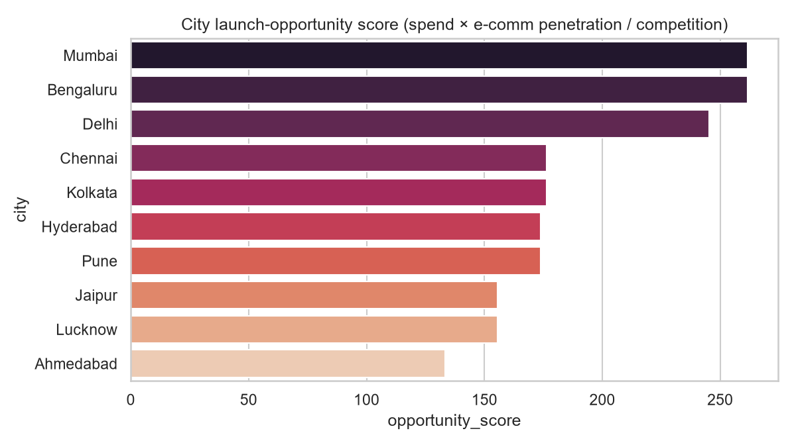
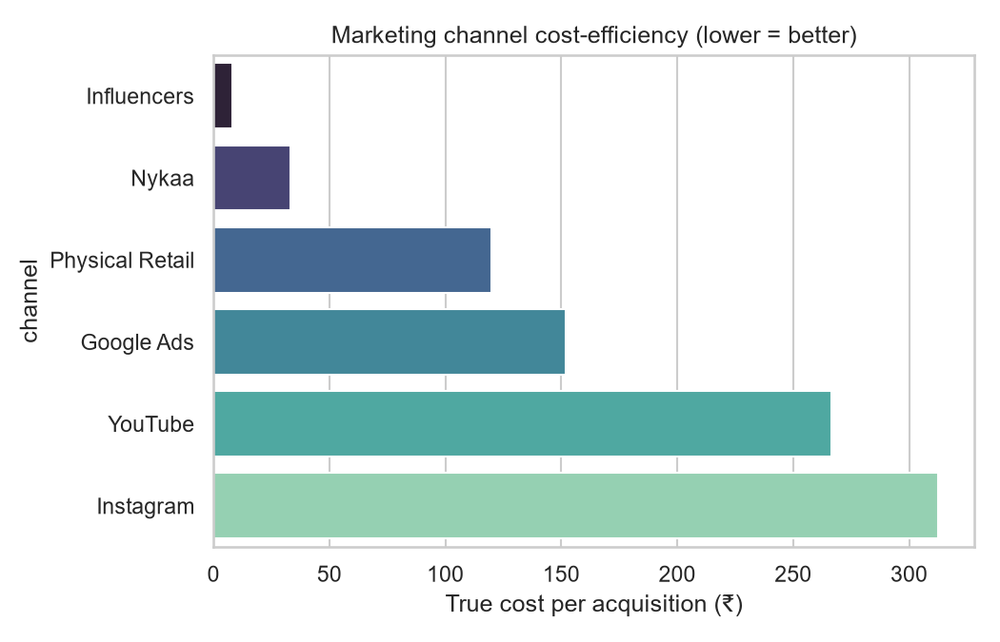

# Premium Sunscreen — India Market-Entry Strategy

*Based on synthetic market data generated by `src/generate_data.py` and analyzed in `notebooks/01_market_eda.ipynb`. All figures are illustrative (synthetic dataset), not real market data.*

## 1. Pricing — where to position

The competitor set clusters tightly at the low end and leaves a wide gap higher up:

| Brand | Price (MRP) | Positioning | Rating |
|---|---|---|---|
| Vaseline | ₹249 | Mass | 3.9 |
| Himalaya | ₹399 | Mass | 4.1 |
| Sun'bly | ₹450 | Mass | 4.2 |
| Minimalist | ₹499 | Mass | 4.4 |
| Biore | ₹549 | Mass | 4.2 |
| Neutrogena | ₹649 | Mass | 4.3 |
| CeraVe | ₹750 | Premium | 4.3 |
| ISDIN | ₹799 | Premium | 4.4 |
| La Roche Posay | ₹899 | Premium | 4.5 |
| Supergoop! | ₹3,199 | Luxury | 4.6 |

**There is no competitor between ₹900 and ₹3,199** — the jump from the top of "Premium" (La Roche Posay) straight to "Luxury" (Supergoop!) is a real gap. CeraVe's mineral/sensitive-skin angle is the strongest performer in the current Premium band (4.3 rating at the lowest Premium price point), suggesting formulation story, not just price, is what justifies the step up from Mass.

**Recommendation:** launch in the **₹900–1,500 band** with a mineral/sensitive-skin positioning — priced above the crowded Mass tier, below Supergoop!'s Luxury outlier, in a gap no current competitor occupies.

## 2. City targeting

Scoring each city on `avg_monthly_skincare_spend × e_commerce_penetration ÷ competition_count`:

| City | Opportunity Score |
|---|---|
| Mumbai | 261.5 |
| Bengaluru | 261.5 |
| Delhi | 245.2 |
| Chennai | 176.5 |
| Kolkata | 176.5 |
| Hyderabad | 173.9 |
| Pune | 173.9 |
| Jaipur | 155.5 |
| Lucknow | 155.5 |
| Ahmedabad | 133.2 |

**Mumbai and Bengaluru are essentially tied for the top spot, with Delhi close behind** — all three Tier 1 metros clearly separate from the rest of the field. Chennai/Kolkata and Hyderabad/Pune form a clear second tier.

*Caveat:* in this synthetic dataset, spend and e-commerce penetration are assigned at the **city-tier** level rather than per city, so cities within the same tier score very close to (or exactly) identical — Mumbai and Bengaluru are tied outright here. A real launch plan would need city-specific data to break ties within a tier — treat this as a tier-level recommendation (start in Tier 1 metros), not a strict city-by-city ranking.

**Recommendation:** launch first in **Mumbai, Bengaluru, and Delhi** (Tier 1), expand to Hyderabad/Chennai in a second phase.

## 3. Marketing channel mix

True cost-per-acquisition, normalizing Influencers' flat campaign cost against its actual reach × conversion (rather than treating it as directly comparable to per-click channel costs):

| Channel | True CPA (₹) |
|---|---|
| Influencers | 8.33 |
| Nykaa | 33.33 |
| Physical Retail | 120.00 |
| Google Ads | 152.00 |
| YouTube | 266.67 |
| Instagram | 312.50 |

**Influencers is the standout channel by a wide margin**, followed by Nykaa (the marketplace channel — relevant since the target segment already shops premium beauty on Nykaa). Paid digital (Instagram, YouTube, Google Ads) is the most expensive way to acquire a customer on this data and is better suited to awareness/education than direct conversion.

**Recommendation:** weight early launch budget toward **influencer partnerships** and a strong **Nykaa marketplace presence**, using paid social for top-of-funnel awareness rather than as the primary acquisition channel.

## 4. Target customer

High monthly skincare spend, low price sensitivity, concentrated in Tier 1 cities — the natural early-adopter segment for a premium launch, and the segment best matched to the ₹900–1,500 pricing band above.

## 5. Summary

| Decision | Recommendation |
|---|---|
| Price band | ₹900–1,500 (mineral/sensitive-skin positioning) |
| Launch cities | Mumbai, Bengaluru, Delhi (Tier 1 first) |
| Primary channel | Influencer partnerships |
| Secondary channel | Nykaa marketplace |
| Target segment | High-spend, low-price-sensitivity, Tier 1 |

*Next steps: validate the city-tier findings against real city-level data (not tier-level assumptions), and test true-CPA assumptions against actual campaign data before committing budget.*